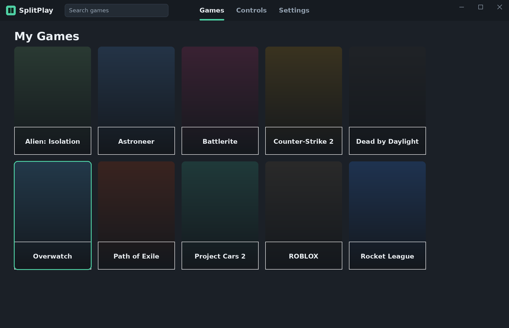
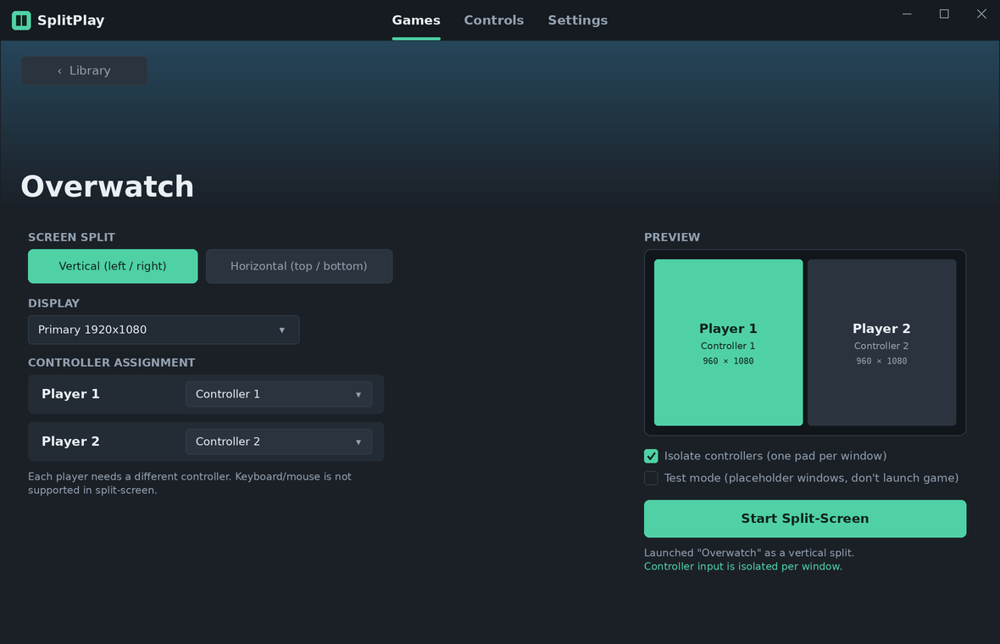
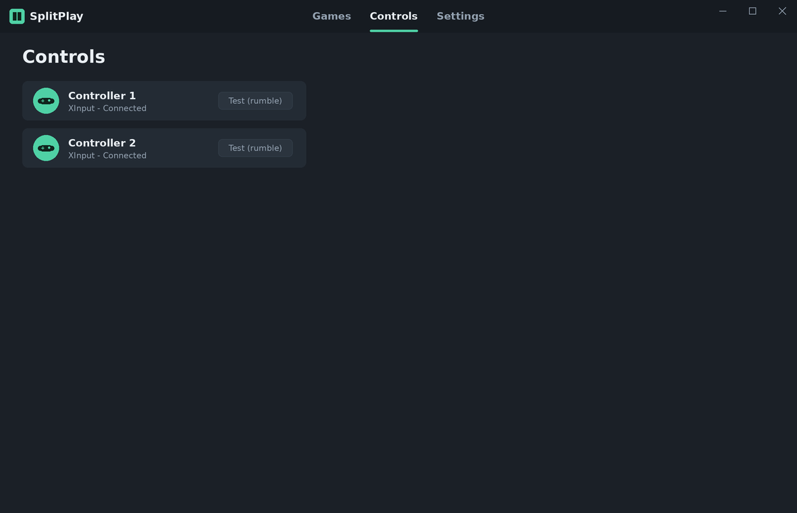

<div align="center">

# 🎮 SplitPlay

**Couch co-op for Steam games that never asked to be couch co-op.**

Two controllers, one PC, one screen sliced cleanly in half — for online co-op
games that stubbornly refuse to do split-screen themselves.

[](https://github.com/blckink/splitscreen/actions/workflows/splitplay-build.yml)


</div>

---

## What is this?

SplitPlay launches a game **twice** on a single PC, tells each copy "you only get
*this one* controller, ignore the others," makes both windows borderless, and tiles
them into a tidy split — vertical or horizontal. Plug in two pads, hit **Start**,
and you and a friend get local split-screen on a game that was only ever built for
two separate machines on a network.

It's the [Nucleus Co-op](https://github.com/SplitScreen-Me/splitscreenme-nucleus)
idea, rebuilt from scratch with a modern .NET 8 / WPF stack, a friendlier UI, and
**per-game settings configured in the app** instead of hunting down handler scripts.

> **Reality check.** SplitPlay is an early MVP. It compiles, it runs, the UI is real,
> controller isolation actually works — and so far it's been properly verified on
> exactly **one** game. We're not going to pretend otherwise. The architecture is
> built to grow; the games list is built to embarrass us until it does. 😅

---

## Does it actually work? (an honest table)

| Thing | Status | Notes |
|---|---|---|
| Scan installed Steam games, show cover tiles | ✅ Works | Parses `libraryfolders.vdf` + `appmanifest_*.acf`, art from local cache → Steam CDN. |
| Per-game profile (split, display, controller routing) | ✅ Works | Stored as JSON in `%AppData%/SplitPlay/profiles/{appid}.json`. |
| Controller detection + rumble test | ✅ Works | XInput discovery with live connect/disconnect. |
| Launch game ×2, borderless, tiled into the split | ✅ Works | Real launch engine + Win32 window placement, pixel-accurate, DPI-aware. |
| **Per-window controller isolation** | ✅ Works | Native XInput proxy: one pad → one window, even in the background. KB+M stay free. |
| Single-account co-op via Steam emulator | 🟡 Wired up | Bundles **gbe_fork**; broader game coverage still being proven out. |
| Verified end-to-end on real games | 🟡 **One** | The honest number. More to come — see the roadmap. |
| Keyboard + mouse players | ❌ Not supported | By design, for now. Two controllers only. |
| 3+ players | ❌ Not yet | MVP is exactly 2. |
| Handler scripts / 800-game library | ❌ Not a thing here | That's Nucleus's superpower. We went a different route (see below). |

**Scope of the MVP:** exactly **2 players**, each on an **XInput controller**, split
**vertically (left/right)** or **horizontally (top/bottom)**.

---

## Screenshots

<div align="center">

| Games | Game detail | Controls |
|---|---|---|
|  |  |  |

</div>

---

## How the magic trick works

No real magic, just a few well-aimed hacks:

- **Controller isolation via a native XInput proxy.** A tiny C++ DLL
  (`native/SplitPlay.XInputProxy`, built with [MinHook](https://github.com/TsudaKageyu/minhook))
  is dropped next to the game (originals backed up, restored crash-safe). Each
  instance launches with a `SPLITPLAY_XINPUT_INDEX` env var, so the proxy exposes
  **only that one physical pad** as index 0 and reports the rest as disconnected.
  It works at the API level, so isolation holds even when a window is in the
  background — and it never touches keyboard or mouse.
- **Borderless tiling.** The launch engine finds each game window, strips its
  border, and positions it to fill exactly its half of the monitor. Per-Monitor-v2
  DPI aware, so no rounding gaps and no "why is it 1px off" rage.
- **Second instance from one Steam account.** SplitPlay ships the unmodified
  [gbe_fork](https://github.com/Detanup01/gbe_fork) Steam emulator so a mirrored
  copy of the game can run a second instance for local co-op.

> SplitPlay does **not** add multiplayer to single-player games. The game already
> needs some form of online/LAN co-op — we just trick it into running twice on one
> couch.

---

## Requirements

- **Windows 10 / 11** (this is Win32 + WPF; there is no Linux/Mac build and there
  won't be one for a while — sorry, penguins).
- Two **XInput / Xbox-style controllers**.
- The one-command installer pulls in everything else (.NET 8, the build tools,
  Inno Setup) for you.

---

## Quick start

### Easiest: one file, no fuss

Grab the latest **`SplitPlaySetup.exe`** from
[Actions → SplitPlay Build → Artifacts](https://github.com/blckink/splitscreen/actions/workflows/splitplay-build.yml)
(or a Releases page once we cut one). It's self-contained: no .NET, no C++ runtime,
no tools on the target PC. Double-click, done.

### Build the installer yourself

```cmd
installer\build-release.cmd
```

Auto-installs every needed tool via `winget` (.NET 8 SDK, Visual C++ Build Tools,
Inno Setup), builds the native proxy, publishes self-contained, and spits out
`installer\output\SplitPlaySetup.exe`. See [installer/README.md](installer/README.md).

### From source (development)

Needs the **.NET 8 SDK** and **Windows**. From the repo root:

```powershell
dotnet build SplitPlay.sln
dotnet run --project src/SplitPlay.App/SplitPlay.App.csproj
```

Or just double-click **`setup.cmd`** — it installs the SDK if missing, then builds
and launches the app.

### Building the native XInput proxy

Controller isolation needs the small native proxy DLL. Requires the
**"Desktop development with C++"** workload (or standalone C++ Build Tools). Build
once (re-run only if `proxy.cpp` changes):

```cmd
native\build-proxy.cmd
```

Produces `native\bin\{x64,x86}\SplitPlay.XInputProxy.dll`; the app build copies them
into its output. **If the proxy is missing, the app still runs** — it just reports
controller isolation as off.

---

## Architecture

The solution is split into focused modules; dependencies only ever point *toward*
`Core`, which is pure and unit-testable.

| Project | Target | Responsibility |
|---|---|---|
| `SplitPlay.Core` | `net8.0` | Domain models, abstractions, pure layout math. No UI/OS deps. |
| `SplitPlay.Steam` | `net8.0-windows` | Locate Steam, parse libraries/manifests, resolve artwork. |
| `SplitPlay.Input` | `net8.0-windows` | XInput discovery + connect/disconnect monitoring. |
| `SplitPlay.Launch` | `net8.0-windows` | Process launch, window placement, isolation, the real launch engine. |
| `SplitPlay.TestTarget` | `net8.0-windows` | Tiny WinForms test window (placeholder + live controller readout). |
| `SplitPlay.App` | `net8.0-windows` | WPF presentation: views, view models, DI composition root. |

```
.
├─ SplitPlay.sln
├─ Directory.Build.props        # shared compiler settings
├─ native/                      # native XInput proxy (C++), built via build-proxy.cmd
├─ installer/                   # one-command release → SplitPlaySetup.exe
├─ redist/                      # fetch-goldberg.ps1 (downloads gbe_fork at build time)
├─ docs/                        # mockups + render script
└─ src/                         # the six projects above
```

- **MVVM, view-first templating.** `App.xaml` maps each page view model to its view
  via `DataTemplate`s; navigation is just swapping the bound view model.
- **Decoupling via interfaces.** View models depend on `Core` abstractions
  (`ISteamLibraryScanner`, `IGamepadService`, `ILaunchEngine`, …); swapping an
  implementation is a one-line change in `AppBootstrapper`.

---

## Roadmap

Roughly in order of "things that stop us being a one-game tech demo":

- **More verified games.** The single most important number on this page.
- Runtime-injection fallback for the rare games that load XInput in a way the
  folder proxy can't shadow (hardcoded System32 path, etc.).
- Instance lifecycle: track launched processes, clean teardown, relaunch.
- Smarter executable / second-instance handling (Steam launch config, launcher →
  game hand-off, single-instance mutex strategies).
- Instance strategies: mirrored copy + emulator and dual real Steam accounts.
- Auto-detection of per-game settings (the goal: retire handler files entirely).
- More than two players; richer controller info (battery / live input); themes.

---

## ⚖️ Legal & licensing — "are we even allowed to do this?"

Short version: **yes, and we did our homework.** Long version:

- **SplitPlay's own code is from scratch.** It is not a fork of anyone's source.
  It's licensed under **[GPL-3.0](LICENSE)**, in the spirit of the co-op-tooling
  ecosystem it grew up admiring.
- **We don't ship anyone's code without honoring their license.** Every third-party
  component we build against or redistribute is listed in
  **[THIRD-PARTY-NOTICES.md](THIRD-PARTY-NOTICES.md)** with its license and source.
  The two that ship in releases:
  - **gbe_fork** (Steam emulator) — **LGPL-3.0**, used unmodified, license + source
    pointer bundled alongside the binaries.
  - **MinHook** — **BSD-2-Clause**, compiled into the proxy, attribution preserved.
- **We didn't copy Nucleus / ProtoInput / x360ce.** We read them, learned from them,
  and wrote our own. They're credited below and in the notices as prior art, not as
  vendored code.
- **Play games you actually own.** SplitPlay is for running *legitimately owned*
  games in split-screen on hardware you control. It does not, and will not, help you
  pirate anything. Don't be that person.

If you're a rights-holder and something here looks off, open an issue — we'd rather
fix it than argue about it.

---

## 🙏 Standing on the shoulders of giants (who did the hard part first)

We borrowed *ideas*, not code, and we owe these projects a proper thank-you:

- **[Nucleus Co-op / SplitScreen.Me](https://github.com/SplitScreen-Me/splitscreenme-nucleus)**
  — the reason this entire category exists. 800+ games, years of thankless plumbing,
  and the patience of saints. If you want the mature, battle-tested tool *today*, go
  use theirs. We're the cheeky new kid; they're the institution.
- **[ProtoInput](https://github.com/SplitScreen-Me/splitscreenme-protoInput)** by
  Ilyaki — the input-isolation wizardry that made us believe "one pad per window"
  was even possible.
- **[Goldberg Emulator](https://gitlab.com/Mr_Goldberg/goldberg_emulator)** &
  **[gbe_fork](https://github.com/Detanup01/gbe_fork)** — for letting a second
  instance exist without selling a kidney for a second copy of every game.
- **[MinHook](https://github.com/TsudaKageyu/minhook)** by Tsuda Kageyu — 200 lines
  of C that quietly do the scariest part of the job.

Full attribution and licenses: **[THIRD-PARTY-NOTICES.md](THIRD-PARTY-NOTICES.md)**.

---

## Contributing

Bug reports, game-verification reports ("it works / it doesn't on *X*"), and PRs are
all welcome. Start with **[CONTRIBUTING.md](CONTRIBUTING.md)** and please be excellent
to each other — see the **[Code of Conduct](CODE_OF_CONDUCT.md)**.

## License

**[GPL-3.0](LICENSE)** © SplitPlay contributors. Third-party components retain their
own licenses — see [THIRD-PARTY-NOTICES.md](THIRD-PARTY-NOTICES.md).
